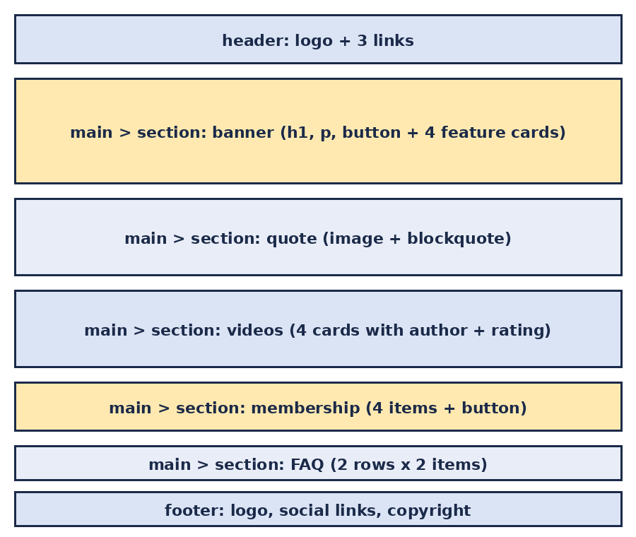

# HTML Advanced: StreamHub landing page

A pure-HTML implementation of a designer mockup (Figma), built from scratch. This first step focuses **only on the semantic structure** of the page. There is no CSS and no styling yet; that comes in the next projects.



## Objectives

- Read a designer file and break it down into blocks (header, banner, quote, videos, membership, FAQ, footer).
- Choose the right semantic tags: `header`, `main`, `section`, `footer`, `h1` to `h3`, `blockquote`, `button`.
- Keep a clean heading hierarchy.
- Write valid HTML (checked with the W3C validator).

## Structure of `index.html`

| Block | Contents |
|---|---|
| `header` | Clickable logo (`a > img`) and a block of 3 links |
| Banner (`main > section`) | `h1`, text and `button`; then an `h2` and 4 cards (`img`, `h3`, `p`) |
| Quote (`section`) | Image, `blockquote`, author and sub-title |
| Videos (`section`) | `h1`, then 4 video cards with thumbnail, title, text, author (`img` + `h3`) and rating (5 star images + text) |
| Membership (`section`) | `h1`, 4 items (`img`, `h2`, `p`) and a `button` |
| FAQ (`section`) | `h1`, then 2 rows of 2 items (`h2` + `p`) |
| `footer` | Logo, social links (`a > img`) and a text |

## Files

```
html_advanced/
├── README.md
├── index.html
└── images/
    ├── page-structure.png   (diagram used in this README)
    └── *.png                (placeholder images used by index.html)
```

## How to view it

Open `index.html` in any modern browser. No build step or server is needed.

To validate it, upload `index.html` to the [W3C Markup Validator](https://validator.w3.org/#validate_by_upload).

## Notes

- The images in `images/` are simple placeholders. Replace them with the assets exported from the Figma file.
- The Figma file needs the fonts Source Sans Pro and Spin Cycle OT, which will matter once styling starts.

## Author

Sano ([sanol-1](https://github.com/sanol-1))
